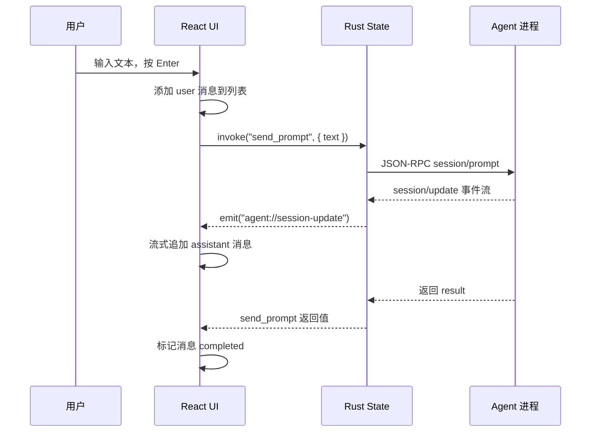
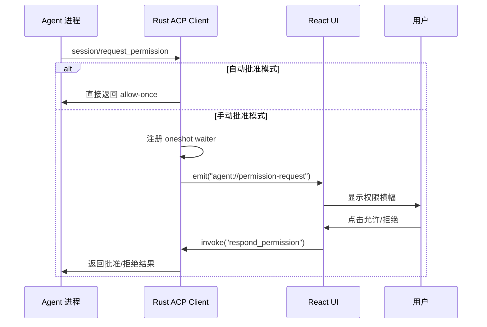
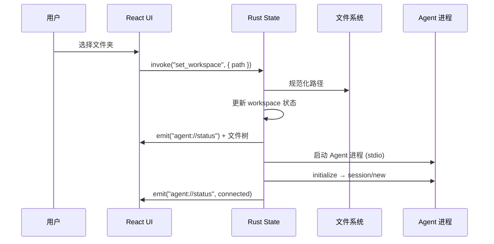

# Nova Build 桌面版 — 产品需求文档（PRD）

> **版本**: 0.1.0  
> **更新日期**: 2026-07-22  
> **状态**: MVP 开发中

---

## 1. 产品概述

### 1.1 产品定位

**Nova Build 桌面版** 是一款跨平台（macOS / Windows）桌面应用，为 [Nova Build](https://github.com/xai-org/nova-build) AI 编程助手提供图形化交互界面。用户无需记忆命令行参数，即可在可视化工作区中与 AI 智能体进行对话、管理项目文件、审查代码变更，并在内置终端中执行命令。

### 1.2 目标用户

| 用户画像 | 核心诉求 |
|----------|----------|
| 软件开发者 | 在 IDE 之外获得 AI 编程辅助，管理多项目工作区 |
| AI 工具使用者 | 便捷切换模型、配置 MCP 服务器，无需接触 CLI |
| 团队协作者 | 审查 AI 生成的代码变更，按需接受或拒绝 |

### 1.3 核心价值

- **零门槛上手**：选择项目文件夹即可开始对话，无需记忆命令
- **可视化工作流**：聊天、文件树、终端、Diff 审阅四合一界面
- **灵活的模型支持**：通过 new-api 网关接入任意兼容模型，一键切换
- **安全的权限管控**：工具执行需用户批准，可切换自动/手动模式
- **原生桌面体验**：基于 Tauri 2，启动快、内存小、系统集成深

---

## 2. 产品架构

### 2.1 技术栈

| 层级 | 技术选型 | 说明 |
|------|----------|------|
| **桌面壳** | Tauri 2 (Rust) | 跨平台窗口管理、系统调用 |
| **前端 UI** | React 19 + TypeScript | 聊天界面、文件树、设置面板 |
| **构建工具** | Vite 7 | 前端开发/构建 |
| **终端模拟** | xterm.js 6.0 + portable-pty | 内置终端面板 |
| **Markdown 渲染** | react-markdown + remark-gfm | AI 回复的消息渲染 |
| **数据持久化** | Tauri Store Plugin + localStorage | 应用设置 + 会话历史 |
| **AI 通信协议** | ACP (Agent Communication Protocol) | JSON-RPC over stdio |

### 2.2 系统架构

```text
React UI（聊天、文件树、终端、设置）
        │
        ▼
Tauri Commands / Events（IPC 桥接）
        │
        ▼
ACP 客户端（Rust，JSON-RPC over stdio）
        │
        ▼
grok agent stdio  ← Nova Build CLI 官方二进制
```

### 2.3 项目结构

```text
nova-desktop/
├── src/                    # React 前端源码
│   ├── components/         # UI 组件
│   │   ├── App.tsx         # 主布局 + 状态编排
│   │   ├── Composer.tsx    # 消息输入框
│   │   ├── Thread.tsx      # 对话消息流
│   │   ├── Sidebar.tsx     # 左侧导航面板
│   │   ├── RightPanel.tsx  # 右侧详情面板
│   │   ├── FileTree.tsx    # 项目文件树
│   │   ├── TerminalView.tsx# 终端模拟器
│   │   ├── ModelPicker.tsx # 模型选择器
│   │   ├── PermissionBanner.tsx # 权限批准横幅
│   │   ├── McpSettingsModal.tsx # MCP 配置弹窗
│   │   └── ErrorBoundary.tsx    # 错误边界
│   ├── hooks/              # 自定义 Hooks
│   │   ├── useAgent.ts     # Agent 连接/消息流管理
│   │   └── useSessions.ts  # 会话持久化管理
│   ├── types/              # TypeScript 类型定义
│   ├── constants/          # 常量（模型建议列表等）
│   └── lib/                # 工具函数（Diff 提取等）
├── src-tauri/              # Rust 后端源码
│   ├── src/
│   │   ├── main.rs         # 入口
│   │   ├── lib.rs          # 模块注册
│   │   ├── commands.rs     # Tauri IPC 命令
│   │   ├── state.rs        # 应用全局状态
│   │   ├── models.rs       # 数据模型
│   │   ├── acp/            # ACP 客户端实现
│   │   │   ├── mod.rs
│   │   │   └── client.rs   # Agent 进程管理 + JSON-RPC
│   │   ├── terminal.rs     # 终端 PTY 管理
│   │   ├── git.rs          # Git 操作封装
│   │   └── workspace.rs    # 文件系统操作
│   └── tauri.conf.json     # Tauri 配置
└── dist/                   # 构建产物
```

---

## 3. 功能需求

### 3.1 工作区管理

**P0 — 核心功能**

| ID | 功能 | 描述 | 优先级 |
|----|------|------|--------|
| WS-01 | 打开项目文件夹 | 通过系统原生对话框选择本地文件夹作为工作区 | P0 |
| WS-02 | 文件树浏览 | 左侧/右侧面板展示项目目录结构（递归 2 层） | P0 |
| WS-03 | 自动过滤 | 自动隐藏 `node_modules`、`.git`、`target`、`dist` 等目录 | P1 |
| WS-04 | 文件夹排序 | 目录优先于文件，字母序排列 | P1 |
| WS-05 | 快捷键打开 | `Ctrl/Cmd + O` 快速打开文件夹对话框 | P2 |

**过滤规则**: 以 `.` 开头的文件/目录、`node_modules`、`.git`、`target`、`dist`、`.next`、`__pycache__`、`.venv`、`venv` 均不展示。

---

### 3.2 AI 对话

**P0 — 核心功能**

| ID | 功能 | 描述 | 优先级 |
|----|------|------|--------|
| CH-01 | 消息输入与发送 | 底部输入框，支持 Enter 发送、Shift+Enter 换行 | P0 |
| CH-02 | 流式消息渲染 | AI 回复以流式逐字呈现，显示绿色脉冲指示灯 | P0 |
| CH-03 | Markdown 渲染 | 支持 GFM 语法（代码块、表格、任务列表等） | P0 |
| CH-04 | 用户/AI/系统消息区分 | 用户消息右对齐蓝底，AI 消息左对齐，系统消息灰色 | P0 |
| CH-05 | 消息自动滚动 | 新消息到来时自动滚动到底部 | P1 |
| CH-06 | 强制中文回复 | 每条消息自动附加"请始终使用简体中文回复"指令 | P1 |
| CH-07 | 空状态引导 | 无对话时显示"今天想做什么？"和趣味图标 | P2 |

**消息模型:**

```typescript
interface ChatMessage {
  id: string;
  role: "user" | "assistant" | "system";
  content: string;
  status: "pending" | "streaming" | "completed" | "error";
}
```

---

### 3.3 会话管理

**P1**

| ID | 功能 | 描述 | 优先级 |
|----|------|------|--------|
| SM-01 | 多会话支持 | 创建多个独立对话会话，从左侧面板切换 | P1 |
| SM-02 | 新建会话 | 点击"新任务"或 `Ctrl/Cmd + N` 创建空白会话 | P1 |
| SM-03 | 会话标题 | 自动提取第一条用户消息作为标题（截取前 36 字） | P1 |
| SM-04 | 会话列表 | 左侧面板显示所有会话，高亮当前活跃项 | P1 |
| SM-05 | 删除会话 | 每个会话项右侧 × 按钮删除 | P2 |
| SM-06 | 会话持久化 | `localStorage` 存储，刷新/重启后恢复 | P1 |
| SM-07 | 会话时间戳 | 记录创建时间和最后更新时间 | P2 |

---

### 3.4 模型管理

**P1**

| ID | 功能 | 描述 | 优先级 |
|----|------|------|--------|
| MM-01 | new-api 网关配置 | 配置统一的 API Base URL 和 API Key | P1 |
| MM-02 | 模型列表管理 | 在设置中添加/删除可用模型（ID + 显示名） | P1 |
| MM-03 | 模型快速切换 | 底部浮窗模型选择器，切换后自动重连 Agent | P1 |
| MM-04 | 快速添加建议 | 预设 GPT-4o、Claude Sonnet 4、DeepSeek V4 Pro 等一键添加 | P2 |
| MM-05 | 当前模型标识 | 模型选择器中 ✓ 标记当前使用模型 | P2 |

**预设模型建议列表:**

| 模型 ID | 显示名称 |
|---------|---------|
| `gpt-4o` | GPT-4o |
| `gpt-4.1` | GPT-4.1 |
| `claude-sonnet-4` | Claude Sonnet 4 |
| `deepseek-v4-pro` | DeepSeek V4 Pro |
| `deepseek-chat` | DeepSeek Chat |
| `grok-4.5` | Grok 4.5 |

---

### 3.5 权限管控

**P1**

| ID | 功能 | 描述 | 优先级 |
|----|------|------|--------|
| PM-01 | 工具执行批准 | Agent 调用工具时弹出横幅，用户点击允许/拒绝 | P1 |
| PM-02 | 自动批准模式 | 可切换为自动批准（默认），无需手动确认 | P1 |
| PM-03 | 超时处理 | 权限请求 5 分钟超时自动拒绝 | P2 |
| PM-04 | 过期请求清理 | 权限请求被取消后自动关闭横幅 | P2 |

**交互细节:**
- "需要批准" 模式：每次工具调用弹出横幅，显示工具名称和参数
- "代我批准" 模式（默认）：所有工具调用自动通过
- 横幅包含"拒绝"/"允许"两个按钮，处理后自动消失

---

### 3.6 Git 集成

**P1**

| ID | 功能 | 描述 | 优先级 |
|----|------|------|--------|
| GI-01 | 变更检测 | 列出工作区所有 Git 变更（修改、新增、删除） | P1 |
| GI-02 | Diff 展示 | 每个变更文件以折叠卡片展示 diff 内容 | P1 |
| GI-03 | 接受变更 | 单文件 `git add` 暂存 | P1 |
| GI-04 | 拒绝变更 | 单文件 `git checkout` 还原；未跟踪文件直接删除 | P1 |
| GI-05 | 全部拒绝 | 一键 `git checkout . && git clean -fd` 还原所有 | P2 |
| GI-06 | 自动刷新 | Agent 完成操作后自动刷新变更列表 | P2 |

**操作流程:**

```text
Agent 修改文件 → 右侧"审阅"面板出现变更 → 审查 Diff → 逐文件接受/拒绝
```

---

### 3.7 内置终端

**P1**

| ID | 功能 | 描述 | 优先级 |
|----|------|------|--------|
| TM-01 | PTY 终端 | 右侧面板嵌入可交互的终端模拟器 | P1 |
| TM-02 | 工作目录同步 | 终端自动使用当前项目文件夹作为工作目录 | P1 |
| TM-03 | Shell 适配 | Windows 使用 PowerShell；macOS/Linux 使用 bash | P1 |
| TM-04 | 终端输入 | 键盘输入直接发送到伪终端 | P1 |
| TM-05 | 终端输出 | PTY 输出通过事件流实时推送到前端 | P1 |
| TM-06 | 窗口自适应 | 面板尺寸变化时终端行列数自动调整 | P2 |
| TM-07 | 快捷键打开 | `Ctrl/Cmd + `` ` 快速打开终端面板 | P2 |

**终端配置:**
- 光标闪烁
- 字号 13px，等宽字体
- 深色主题（背景 `#111111`，前景 `#f5f5f5`）

---

### 3.8 活动日志

**P2**

| ID | 功能 | 描述 | 优先级 |
|----|------|------|--------|
| AC-01 | 工具调用记录 | 右侧"活动"标签展示 Agent 工具调用历史 | P2 |
| AC-02 | 计划展示 | Agent 执行计划步骤以列表形式展示 | P2 |
| AC-03 | 记录上限 | 保留最近 100 条活动记录 | P2 |

---

### 3.9 MCP 服务器配置

**P2**

| ID | 功能 | 描述 | 优先级 |
|----|------|------|--------|
| MC-01 | MCP 列表管理 | 添加/编辑/删除 MCP 服务器配置 | P2 |
| MC-02 | stdio 传输 | 支持本地命令行 MCP 服务器（如 npx） | P2 |
| MC-03 | HTTP 传输 | 支持远程 Streamable HTTP MCP 服务器 | P2 |
| MC-04 | 环境变量配置 | 每个 MCP 服务器可配置多个环境变量 | P2 |
| MC-05 | Session 透传 | MCP 配置在 `session/new` 时传给 Agent | P2 |

**配置数据结构:**

```typescript
interface McpServerConfig {
  name: string;          // 服务器名称
  command: string;       // 启动命令或 HTTP URL
  args?: string[];       // 命令行参数
  env?: McpEnvVar[];     // 环境变量
}
```

---

### 3.10 设置与配置

**P1**

| ID | 功能 | 描述 | 优先级 |
|----|------|------|--------|
| ST-01 | Agent 命令配置 | 自定义 grok CLI 路径和启动参数 | P1 |
| ST-02 | API 配置 | Base URL + API Key（支持系统环境变量回退） | P1 |
| ST-03 | 设置持久化 | Tauri Store Plugin 存储为 `settings.json` | P1 |
| ST-04 | 连接管理 | 工作区底部显示连接状态（绿点=已连接），支持重连/断开 | P1 |
| ST-05 | 旧存档兼容 | 兼容 `novaCommand`、`novaArgs` 等历史字段名 | P2 |

**设置存储结构:**

```typescript
interface AppSettings {
  grokCommand: string;              // CLI 路径，默认 ~/.grok/bin/grok(.exe)
  grokArgs: string[];               // 默认 ["agent", "stdio"]
  autoApprovePermissions: boolean;  // 默认 true
  apiBaseUrl: string;               // new-api 网关地址
  apiKey: string;                   // API 密钥
  modelId: string;                  // 当前选用的模型 ID
  models: ModelEntry[];             // 可用模型列表
  mcpServers: McpServerConfig[];    // MCP 服务器列表
}
```

---

## 4. 非功能需求

### 4.1 性能

| 指标 | 目标 |
|------|------|
| 应用启动时间 | < 3 秒（冷启动） |
| 消息流式延迟 | 首字节 < 500ms |
| 文件树加载 | 1000 文件 < 1 秒 |
| 内存占用 | 空闲 < 200MB |

### 4.2 跨平台

| 平台 | 最低版本 |
|------|----------|
| Windows | Windows 10 + WebView2 |
| macOS | macOS 11 (Big Sur) |

### 4.3 国际化

- 默认语言：简体中文（zh-CN）
- UI 文案均为中文
- AI 回复强制使用简体中文
- 工具状态英文自动本地化（如 `pending` → `等待中`）

### 4.4 安全

- API Key 支持密码输入框遮挡
- 工具权限支持手动批准模式（`autoApprovePermissions: false`）
- 权限请求 5 分钟超时自动拒绝
- 文件操作仅限工作区范围内（依赖 Agent 端约束）

### 4.5 可维护性

- TypeScript 严格类型检查
- React ErrorBoundary 全局异常捕获
- Rust `anyhow` + `thiserror` 统一错误处理
- `tracing` 日志框架

---

## 5. 用户界面

### 5.1 布局

采用三栏式布局（Codex 风格）：

```
┌──────────┬───────────────────────┬───────────┐
│  Sidebar │      Main Stage      │  Right    │
│          │                      │  Panel    │
│  导航栏   │   Thread (对话流)     │  文件/审阅 │
│  对话列表  │                      │  终端/活动 │
│  文件树   │   Composer (输入框)   │           │
│  设置     │                      │           │
│  连接状态  │                      │           │
└──────────┴───────────────────────┴───────────┘
```

- **Sidebar 宽度**: 260px
- **Right Panel 宽度**: 320px
- **窗口默认尺寸**: 1280 × 820
- **最小尺寸**: 960 × 640

### 5.2 键盘快捷键

| 快捷键 | 功能 |
|--------|------|
| `Ctrl/Cmd + N` | 新建对话 |
| `Ctrl/Cmd + O` | 打开项目文件夹 |
| `Ctrl/Cmd + `` ` | 打开终端面板 |
| `Enter` | 发送消息（输入框内） |
| `Shift + Enter` | 消息换行 |

### 5.3 色板

| 用途 | 色值 |
|------|------|
| 页面背景 | `#ffffff` |
| 侧栏背景 | `#fafafa` |
| 主文字 | `#111111` |
| 次要文字 | `#6b6b6b` |
| 辅助文字 | `#9a9a9a` |
| 强调色 | `#111111` |
| 成功绿 | `#0f7b4c` |
| 错误红 | `#c62828` |
| 分割线 | `#efefef` |

---

## 6. API / 协议设计

### 6.1 ACP (Agent Communication Protocol)

基于 JSON-RPC 2.0 over stdio，双向通信。

**客户端 → Agent（请求）:**

| 方法 | 说明 | 参数 |
|------|------|------|
| `initialize` | 初始化连接 | `protocolVersion`, `clientCapabilities`, `clientInfo` |
| `session/new` | 创建会话 | `cwd`, `mcpServers` |
| `session/prompt` | 发送用户提示 | `sessionId`, `prompt[]` |

**Agent → 客户端（通知 + 请求）:**

| 方法 | 说明 | 触发时机 |
|------|------|----------|
| `session/update` | 流式消息更新 | agent_message_chunk / tool_call / plan |
| `session/request_permission` | 权限请求 | 工具调用前 |
| `fs/read_text_file` | 读取文件 | Agent 需要读取文件内容时 |
| `fs/write_text_file` | 写入文件 | Agent 需要写入文件内容时 |

**客户端能力声明:**

```json
{
  "fs": {
    "readTextFile": true,
    "writeTextFile": true
  }
}
```

### 6.2 流式更新类型

| sessionUpdate 值 | 含义 | 处理方式 |
|------------------|------|---------|
| `agent_message_chunk` | AI 文本片段 | 追加到当前消息末尾 |
| `tool_call` | 工具调用开始 | 记入活动日志 |
| `tool_call_update` | 工具调用状态变更 | 更新活动日志 |
| `plan` | 执行计划 | 解析计划条目，记入活动日志 |

### 6.3 权限响应

客户端根据用户选择构造 `selected` 或 `cancelled` 结果，optionId 按优先级匹配：

```json
// 用户允许
{ "outcome": { "outcome": "selected", "optionId": "allow-once" } }

// 用户拒绝
{ "outcome": { "outcome": "selected", "optionId": "reject-once" } }
```

---

## 7. 数据流

### 7.1 用户发送消息



### 7.2 权限请求流程



### 7.3 工作区打开流程



---

## 8. 部署与构建

### 8.1 开发环境

```bash
# 依赖
Node.js 20+
Rust (rustup)
Windows: Visual Studio Build Tools + WebView2
macOS: Xcode Command Line Tools
Nova Build CLI (grok)

# 启动
npm install
npm run tauri dev
```

### 8.2 构建产物

```bash
npm run tauri build
```

产物输出至 `src-tauri/target/release/bundle/`，包含：
- Windows: `.msi` / `.exe`
- macOS: `.dmg` / `.app`

### 8.3 前置依赖

- 用户需安装 Git（用于变更检测功能）
- 用户需安装 Nova Build CLI（`grok` 或 `nova`）
- Windows 需预装 WebView2 运行时

---

## 9. 产品路线图

### MVP（v0.1.0）✅ 已完成

- [x] 工作区管理与文件树
- [x] AI 对话（流式 Markdown 渲染）
- [x] 多会话管理（localStorage 持久化）
- [x] new-api 模型配置与切换
- [x] 权限批准横幅（手动/自动模式）
- [x] Git 变更检测与 Diff 审阅
- [x] 内置 PTY 终端
- [x] MCP 服务器配置
- [x] 活动日志

### v0.2.0 计划中

- [ ] Inline Diff 查看器（文件编辑行级对比）
- [ ] 会话列表 / 恢复（跨设备同步）
- [ ] macOS 代码签名
- [ ] Windows 安装器美化
- [ ] 深色模式支持
- [ ] 自定义快捷键
- [ ] 导出对话记录

### v0.3.0 展望

- [ ] 多窗口支持
- [ ] 插件系统
- [ ] 远程工作区（SSH）
- [ ] 团队协作功能
- [ ] CI/CD 集成

---

## 10. 附录

### 10.1 术语表

| 术语 | 全称 | 说明 |
|------|------|------|
| ACP | Agent Communication Protocol | AI 智能体通信协议，基于 JSON-RPC |
| MCP | Model Context Protocol | 模型上下文协议，用于工具集成 |
| PTY | Pseudo Terminal | 伪终端，实现终端模拟的核心机制 |
| new-api | — | 兼容 OpenAI API 的第三方网关 |
| stdio | Standard Input/Output | 标准输入输出流 |

### 10.2 技术依赖

**前端 (npm):**

| 包名 | 版本 | 用途 |
|------|------|------|
| react / react-dom | ^19.1.0 | UI 框架 |
| @tauri-apps/api | ^2 | Tauri IPC 桥接 |
| @tauri-apps/plugin-dialog | ^2 | 原生文件对话框 |
| @tauri-apps/plugin-opener | ^2 | 系统默认应用打开 |
| @xterm/xterm | ^6.0.0 | 终端模拟器 |
| react-markdown | ^10.1.0 | Markdown 渲染 |
| remark-gfm | ^4.0.1 | GFM 扩展支持 |

**后端 (Cargo):**

| crate | 版本 | 用途 |
|------|------|------|
| tauri | 2 | 应用框架 |
| tokio | 1 | 异步运行时 |
| serde / serde_json | 1 | 序列化 |
| portable-pty | 0.8 | 伪终端 |
| parking_lot | 0.12 | 高性能锁 |
| uuid | 1 | 唯一 ID 生成 |
| tracing | 0.1 | 日志框架 |
| anyhow / thiserror | — | 错误处理 |

### 10.3 变更记录

| 日期 | 版本 | 变更内容 |
|------|------|----------|
| 2026-07-22 | 0.1.0 | 初始版本，PRD 创建 |

---

> **本文档基于项目源码 `D:\grokbuikd` 逆向生成，反映当前 MVP 阶段的完整功能与架构设计。**
