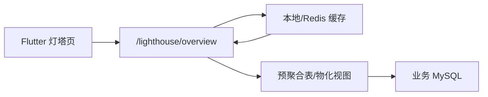

# 灯塔后端字段对接契约

## 结论

现在 Flutter 侧已经能接后端数据，但能不能“对上”，取决于后端是否按本文档返回字段。

前端不会直接理解数据库原始字段名。后端必须把 SQL 查询结果转换成灯塔约定字段，例如：

```sql
SUM(real_sales_amount) AS sales,
SUM(real_profit_amount) AS profit
```

只要后端返回的 JSON 结构和字段名与本文档一致，灯塔页面的一级列表、详情页、指标、排序、分类筛选都可以直接复用。

## 接口

前端当前请求：

```text
GET http://localhost:6090/api/v1/lighthouse/overview?period=month
Authorization: Bearer <token>
```

如果后端 `apiBase` 是 `/api/v1`，完整路径就是：

```text
GET /api/v1/lighthouse/overview?period=month
```

## 并发和响应速度目标

灯塔是首页级经营看板，用户进入页面时会一次性请求首屏数据，所以后端不要在每次请求时临时跑大量明细 SQL。建议把接口设计成“读缓存为主、查库聚合为辅”。

建议目标：

| 指标 | 建议值 | 说明 |
| --- | --- | --- |
| P50 响应时间 | `< 300ms` | 缓存命中时的常规目标 |
| P95 响应时间 | `< 800ms` | 多人同时打开灯塔时仍应可用 |
| 超时时间 | `2s ~ 3s` | 超过后返回缓存或降级数据 |
| 单次返回体 | 建议 `< 1MB` | 首版完整返回可以接受，但不要无限下发明细 |
| 并发目标 | 至少 `50 ~ 100` 并发读 | 内部看板场景的基本容量 |

如果实时查库无法达到这个目标，应优先做服务端缓存或预聚合表，而不是让 Flutter 前端拆多次请求补数据。

## 推荐后端架构



推荐优先级：

1. **优先读缓存**：`period + dataVersion + userScope` 作为缓存 key。
2. **缓存未命中再读预聚合表**：不要直接扫交易明细大表。
3. **后台任务定时刷新缓存**：例如每 5 分钟刷新一次，或数据同步完成后主动刷新。
4. **接口只做轻量组装**：把 SQL 结果组装成本文档约定 JSON，不做复杂二次计算。

## 缓存策略

### 缓存 key

建议：

```text
lighthouse:overview:{period}:{bizDate}:{scope}
```

示例：

```text
lighthouse:overview:month:2026-06-26:all
```

如果不同角色、部门、租户看到的数据不同，必须把权限范围放进 `scope`，否则会出现越权缓存。

### 缓存内容

可以直接缓存最终 JSON：

```text
data + product_detail + supply_detail + channel_detail + metrics
```

这样缓存命中时不需要再次查库和组装，响应最快。

### TTL 建议

| 数据类型 | TTL 建议 |
| --- | --- |
| 今日 / 本周 | `1 ~ 5 分钟` |
| 本月 | `5 ~ 15 分钟` |
| 本季 / 今年 | `15 ~ 30 分钟` |

如果数据同步是批处理，可以在批处理完成后主动清理缓存，而不是只依赖 TTL。

### 防缓存击穿

同一时间很多用户打开灯塔时，如果缓存刚好失效，可能同时打到 MySQL。建议：

- 对同一个 cache key 加短锁，只有一个请求重建缓存。
- 其他请求等待短时间或直接返回旧缓存。
- 保留 `stale cache`，即缓存过期后短时间内仍可作为降级返回。

伪流程：

```text
读缓存 -> 命中返回
未命中 -> 尝试拿 rebuild lock
拿到锁 -> 查预聚合表 -> 写缓存 -> 返回
没拿到锁 -> 返回 stale cache 或等待 100ms 后再读缓存
```

## 数据库连接池建议

数据库连接信息必须放后端环境变量，不要进入 Flutter、Git 或日志。

连接池建议：

| 配置 | 建议 |
| --- | --- |
| 最大连接数 | `10 ~ 30`，按后端实例数和 MySQL 承载能力调整 |
| 最小空闲连接 | `2 ~ 5` |
| 获取连接超时 | `500ms ~ 1s` |
| SQL 查询超时 | `1s ~ 2s` |
| 连接最大生命周期 | 小于 MySQL wait_timeout |
| 账号权限 | 只读账号，只授权需要的库表 |

注意：不要为了并发简单把连接池开很大。连接池过大会把压力直接打到 MySQL，导致全库变慢。

## Go + Hertz 代码层级优化方案

如果后端用 Go + Hertz，建议从一开始就按“快路径返回缓存字节、慢路径后台重建”的方式写。不要每个请求都重新查库、重新组装大 map、重新 marshal。

### 推荐目录结构

```text
internal/lighthouse/
  handler.go       # Hertz handler，只做参数/鉴权/返回
  service.go       # 业务编排：缓存、singleflight、降级
  repository.go    # MySQL 查询，所有 SQL 在这里
  model.go         # 强类型 response struct，json tag 固定字段名
  cache.go         # Redis/本地缓存封装
  period.go        # period -> 日期范围
```

### 建议依赖

```text
github.com/cloudwego/hertz
github.com/go-sql-driver/mysql
golang.org/x/sync/errgroup
golang.org/x/sync/singleflight
github.com/bytedance/sonic
```

缓存层可以二选一：

- 单实例或开发环境：进程内缓存，启动快，但多实例不共享。
- 生产多实例：Redis 缓存，所有后端实例共享灯塔 JSON。

如果先做最小版本，建议：`Hertz + database/sql + go-sql-driver/mysql + singleflight + sonic + 进程内缓存`。上线多实例后再把缓存换成 Redis。

## Docker 启动方案

后端建议容器化启动。容器里只放编译后的 Go 二进制，不放数据库密码，不把 `.env` 打进镜像。

### Dockerfile

推荐多阶段构建：

```dockerfile
# syntax=docker/dockerfile:1

FROM golang:1.23-alpine AS builder

WORKDIR /app
RUN apk add --no-cache git ca-certificates tzdata

COPY go.mod go.sum ./
RUN go mod download

COPY . .

RUN CGO_ENABLED=0 GOOS=linux GOARCH=amd64 \
    go build -trimpath -ldflags="-s -w" -o /out/lighthouse-api ./cmd/lighthouse-api

FROM alpine:3.20

WORKDIR /app
RUN apk add --no-cache ca-certificates tzdata

ENV TZ=Asia/Shanghai

COPY --from=builder /out/lighthouse-api /app/lighthouse-api

EXPOSE 8080

ENTRYPOINT ["/app/lighthouse-api"]
```

要点：

- `CGO_ENABLED=0`：产物更容易放进轻量镜像。
- `-trimpath -ldflags="-s -w"`：减小二进制体积。
- `tzdata`：保证 `Asia/Shanghai` 周期计算正确。
- 不复制 `.env` 到镜像。

### .dockerignore

```text
.git
.env
.env.*
tmp
logs
coverage
Dockerfile
docker-compose.yml
```

### docker-compose.yml

如果生产用外部 MySQL，compose 里只启动后端和 Redis：

```yaml
services:
  lighthouse-api:
    build:
      context: .
      dockerfile: Dockerfile
    image: dunes/lighthouse-api:local
    container_name: lighthouse-api
    restart: unless-stopped
    ports:
      - "8080:8080"
    env_file:
      - .env
    environment:
      APP_ENV: "prod"
      TZ: "Asia/Shanghai"
      HTTP_ADDR: ":8080"
      REDIS_ADDR: "redis:6379"
    depends_on:
      redis:
        condition: service_healthy
    healthcheck:
      test: ["CMD", "wget", "-qO-", "http://127.0.0.1:8080/healthz"]
      interval: 10s
      timeout: 2s
      retries: 3
      start_period: 10s

  redis:
    image: redis:7-alpine
    container_name: lighthouse-redis
    restart: unless-stopped
    command: ["redis-server", "--appendonly", "no", "--save", ""]
    healthcheck:
      test: ["CMD", "redis-cli", "ping"]
      interval: 10s
      timeout: 2s
      retries: 3
```

### .env 示例

`.env` 只放在服务器上，不提交 Git。

```bash
APP_ENV=prod
HTTP_ADDR=:8080

LIGHTHOUSE_DB_DSN=<mysql_user>:<mysql_password>@tcp(<mysql_host>:3306)/sel-mg?charset=utf8mb4&parseTime=true&loc=Asia%2FShanghai&timeout=1s&readTimeout=2s&writeTimeout=2s

MYSQL_MAX_OPEN_CONNS=20
MYSQL_MAX_IDLE_CONNS=5
MYSQL_CONN_MAX_LIFETIME=30m
MYSQL_CONN_MAX_IDLE_TIME=5m

REDIS_ADDR=redis:6379
REDIS_PASSWORD=
REDIS_DB=0

LIGHTHOUSE_CACHE_TTL_MONTH=10m
LIGHTHOUSE_CACHE_TTL_DAY=2m
LIGHTHOUSE_STALE_TTL=30m
```

注意：

- 文档里不要写真实账号密码。
- DSN 里建议设置 `timeout/readTimeout/writeTimeout`，避免容器内请求卡死。
- 如果 MySQL 是外部地址，要确认 Docker 容器所在机器能访问 3306。

### Hertz 健康检查

容器 healthcheck 需要一个轻量接口，不要在健康检查里查 MySQL。

```go
h.GET("/healthz", func(ctx context.Context, c *app.RequestContext) {
	c.JSON(consts.StatusOK, map[string]any{
		"ok": true,
	})
})
```

如果要检查 MySQL，建议另开 `/readyz`，用于发布前探活，不要让 Docker 每 10 秒打一次数据库。

```go
h.GET("/readyz", func(ctx context.Context, c *app.RequestContext) {
	ctx, cancel := context.WithTimeout(ctx, 300*time.Millisecond)
	defer cancel()
	if err := db.PingContext(ctx); err != nil {
		c.JSON(consts.StatusServiceUnavailable, map[string]any{"ok": false})
		return
	}
	c.JSON(consts.StatusOK, map[string]any{"ok": true})
})
```

### 启动命令

```bash
docker compose up -d --build
```

查看日志：

```bash
docker compose logs -f lighthouse-api
```

验证接口：

```bash
curl -H "Authorization: Bearer <token>" \
  "http://127.0.0.1:8080/api/v1/lighthouse/overview?period=month"
```

压测容器：

```bash
hey -z 60s -c 100 -H "Authorization: Bearer <token>" \
  "http://127.0.0.1:8080/api/v1/lighthouse/overview?period=month"
```

### Docker 下的性能注意事项

- 不要把 MySQL 放进同一个 compose 作为生产数据库；生产 MySQL 应该是外部托管或独立部署。
- 如果使用 Redis 缓存，后端多副本可以共享缓存，避免每个容器都查库重建。
- 容器 CPU/内存要设置上限后压测，避免本地无限资源掩盖问题。
- 日志输出到 stdout/stderr，交给 Docker 或日志系统采集。
- 容器内时区固定 `Asia/Shanghai`，否则 `period=day/week/month` 可能按 UTC 算错。
- 发布时先预热缓存，再切流量，避免上线瞬间所有请求打到 MySQL。

### 多副本启动

如果要启动多个后端副本：

```bash
docker compose up -d --scale lighthouse-api=3
```

注意：

- 多副本时不要固定 `container_name`，否则 compose 无法 scale。
- `ports: "8080:8080"` 只能给单副本用；多副本应放到 Nginx / SLB / API 网关后面。
- 多副本必须使用 Redis 或其它共享缓存，否则每个副本都会各自重建缓存。
- 每个副本的 MySQL 连接池都要算入总连接数，例如 3 个副本 × 20 连接 = 60 个 MySQL 连接。

### 启动预热

容器启动后，可以主动预热常用 period：

```bash
curl -H "Authorization: Bearer <token>" \
  "http://127.0.0.1:8080/api/v1/lighthouse/overview?period=month"

curl -H "Authorization: Bearer <token>" \
  "http://127.0.0.1:8080/api/v1/lighthouse/overview?period=day"
```

也可以在服务启动后异步预热，但要注意不要阻塞 `/healthz`：

```go
go func() {
	ctx, cancel := context.WithTimeout(context.Background(), 5*time.Second)
	defer cancel()
	_ = svc.Warmup(ctx, []string{"day", "month"})
}()
```

### Hertz 路由

```go
func RegisterLighthouseRoutes(r *server.Hertz, svc *lighthouse.Service) {
	api := r.Group("/api/v1")
	api.GET("/lighthouse/overview", func(ctx context.Context, c *app.RequestContext) {
		svc.Overview(ctx, c)
	})
}
```

Handler 层不要写 SQL，也不要做复杂 JSON 组装。它只负责：

- 读取 `period`
- 读取登录态/用户范围
- 调 service
- 返回 JSON 或缓存好的 `[]byte`

### Handler 快路径：直接返回缓存 JSON bytes

缓存最终 JSON 字节比缓存 Go struct 更快，因为命中缓存时可以跳过 marshal。

```go
func (s *Service) Overview(ctx context.Context, c *app.RequestContext) {
	period := string(c.QueryArgs().Peek("period"))
	if period == "" {
		period = "month"
	}

	userScope := ScopeFromAuth(c)
	key := BuildCacheKey(period, time.Now(), userScope)

	if bs, ok := s.cache.GetBytes(ctx, key); ok {
		c.Response.Header.SetContentType("application/json; charset=utf-8")
		c.Data(consts.StatusOK, "application/json; charset=utf-8", bs)
		return
	}

	bs, stale, err := s.BuildOrLoadOverview(ctx, key, period, userScope)
	if err != nil {
		c.JSON(consts.StatusServiceUnavailable, map[string]any{
			"success": false,
			"message": "灯塔数据暂时不可用，请稍后再试",
		})
		return
	}

	if stale {
		c.Response.Header.Set("X-Lighthouse-Stale", "1")
	}
	c.Response.Header.SetContentType("application/json; charset=utf-8")
	c.Data(consts.StatusOK, "application/json; charset=utf-8", bs)
}
```

### 使用 singleflight 防止缓存击穿

同一个缓存 key 过期时，只允许一个 goroutine 去查库重建，其它请求复用结果或返回旧缓存。

```go
type Service struct {
	repo  *Repository
	cache Cache
	group singleflight.Group
}

func (s *Service) BuildOrLoadOverview(
	ctx context.Context,
	key string,
	period string,
	scope Scope,
) ([]byte, bool, error) {
	if stale, ok := s.cache.GetStaleBytes(ctx, key); ok {
		go s.Refresh(context.Background(), key, period, scope)
		return stale, true, nil
	}

	v, err, _ := s.group.Do(key, func() (any, error) {
		return s.Refresh(ctx, key, period, scope)
	})
	if err != nil {
		return nil, false, err
	}
	return v.([]byte), false, nil
}
```

### Refresh 内部并行查询

`product`、`supply`、`channel` 三个一级聚合互不依赖，可以并行查。但不要无限开 goroutine，最多按固定查询数并发。

```go
func (s *Service) Refresh(ctx context.Context, key string, period string, scope Scope) ([]byte, error) {
	ctx, cancel := context.WithTimeout(ctx, 2*time.Second)
	defer cancel()

	dateRange := ResolvePeriod(period, time.Now())
	var resp OverviewResponse

	g, ctx := errgroup.WithContext(ctx)
	g.Go(func() error {
		rows, err := s.repo.QueryProductRows(ctx, dateRange, scope)
		resp.Data.Product = rows
		return err
	})
	g.Go(func() error {
		rows, err := s.repo.QuerySupplyRows(ctx, dateRange, scope)
		resp.Data.Supply = rows
		return err
	})
	g.Go(func() error {
		rows, err := s.repo.QueryChannelRows(ctx, dateRange, scope)
		resp.Data.Channel = rows
		return err
	})
	if err := g.Wait(); err != nil {
		return nil, err
	}

	// 详情也应该批量查询，不要按一级行 N+1 查询。
	if err := s.fillDetails(ctx, &resp, dateRange, scope); err != nil {
		return nil, err
	}

	bs, err := sonic.Marshal(resp)
	if err != nil {
		return nil, err
	}
	s.cache.SetBytes(ctx, key, bs, TTLFor(period))
	return bs, nil
}
```

### 用强类型 struct，不要用大 Map 拼 JSON

后端推荐定义强类型结构体，字段名通过 `json` tag 固定。这样比到处 `map[string]any` 更稳、更快，也能让编译期发现字段遗漏。

```go
type OverviewResponse struct {
	Data          OverviewData             `json:"data"`
	ProductDetail map[string]DetailPayload `json:"product_detail"`
	SupplyDetail  map[string]DetailPayload `json:"supply_detail"`
	ChannelDetail map[string]DetailPayload `json:"channel_detail"`
	Metrics       map[string]any           `json:"metrics"`
}

type OverviewData struct {
	Product []MetricRow `json:"product"`
	Supply  []MetricRow `json:"supply"`
	Channel []MetricRow `json:"channel"`
}

type MetricRow struct {
	Name        string  `json:"name"`
	Group       string  `json:"group"`
	Sales       float64 `json:"sales"`
	GMV         float64 `json:"gmv"`
	GMV2        float64 `json:"gmv2"`
	ITS         float64 `json:"its"`
	ITSAfter    float64 `json:"itsAfter"`
	Spread      float64 `json:"spread"`
	WOA         float64 `json:"woa"`
	Revenue     float64 `json:"revenue"`
	TotalCost   float64 `json:"totalCost"`
	Cost        float64 `json:"cost"`
	Tax         float64 `json:"tax"`
	ProjectCost float64 `json:"projectCost"`
	SaasFee     float64 `json:"saasFee"`
	Deferred    float64 `json:"deferred"`
	Discount    float64 `json:"discount"`
	Profit      float64 `json:"profit"`
}
```

建议所有 number 字段都返回 `0`，不要省略。这样前端指标切换、排序和详情聚合最稳定。

### JSON 序列化

Hertz/CloudWeGo 常见组合里可以使用 `sonic` 提升大 JSON marshal 性能：

```go
import "github.com/bytedance/sonic"

bs, err := sonic.Marshal(resp)
```

缓存命中时不要再 marshal：

```go
c.Data(consts.StatusOK, "application/json; charset=utf-8", cachedBytes)
```

### MySQL Repository 写法

Repository 层只返回强类型 slice，不返回 `map[string]any`。

```go
func (r *Repository) QueryProductRows(ctx context.Context, dr DateRange, scope Scope) ([]MetricRow, error) {
	const q = `
SELECT
  product_name AS name,
  product_group AS group_name,
  SUM(sales_amount) AS sales,
  SUM(traffic_gmv) AS gmv,
  SUM(gmv_amount) AS gmv2,
  SUM(its_amount) AS its,
  SUM(its_after_discount) AS its_after,
  SUM(spread_amount) AS spread,
  SUM(woa_amount) AS woa,
  SUM(revenue_amount) AS revenue,
  SUM(total_cost_amount) AS total_cost,
  SUM(business_cost_amount) AS cost,
  SUM(tax_cost_amount) AS tax,
  SUM(profit_amount) AS profit
FROM lighthouse_daily_fact
WHERE biz_date >= ? AND biz_date < ?
GROUP BY product_name, product_group
ORDER BY profit DESC
LIMIT 100`

	rows, err := r.db.QueryContext(ctx, q, dr.Start, dr.End)
	if err != nil {
		return nil, err
	}
	defer rows.Close()

	out := make([]MetricRow, 0, 100)
	for rows.Next() {
		var x MetricRow
		if err := rows.Scan(
			&x.Name,
			&x.Group,
			&x.Sales,
			&x.GMV,
			&x.GMV2,
			&x.ITS,
			&x.ITSAfter,
			&x.Spread,
			&x.WOA,
			&x.Revenue,
			&x.TotalCost,
			&x.Cost,
			&x.Tax,
			&x.Profit,
		); err != nil {
			return nil, err
		}
		out = append(out, x)
	}
	return out, rows.Err()
}
```

注意 MySQL 里 `group` 是保留字风险，SQL 里建议查成 `group_name`，Go struct 再输出 JSON `group`。

### database/sql 连接池配置

```go
db.SetMaxOpenConns(20)
db.SetMaxIdleConns(5)
db.SetConnMaxLifetime(30 * time.Minute)
db.SetConnMaxIdleTime(5 * time.Minute)
```

建议从小连接池开始压测，不要一开始开很大。多个后端实例的总连接数不能超过 MySQL 可承受上限。

### Hertz Server 参数

可以显式配置读写超时和最大请求体。灯塔接口是 GET，不需要大请求体。

```go
h := server.Default(
	server.WithHostPorts(":8080"),
	server.WithReadTimeout(3*time.Second),
	server.WithWriteTimeout(3*time.Second),
	server.WithMaxRequestBodySize(1<<20),
)
```

### 避免的慢写法

不要这样写：

- 每次请求实时扫交易明细表。
- 每个一级行循环查一次详情，导致 N+1 SQL。
- 用 `map[string]any` 层层拼大 JSON。
- 缓存 struct 后每次请求重新 marshal。
- 不设置 SQL timeout，让慢查询拖住 goroutine。
- 日志打印完整响应 JSON。
- MySQL 连接池无限放大。

推荐这样写：

- 查日汇总表或预聚合表。
- 一级和详情批量查询。
- 强类型 struct。
- 缓存最终 JSON bytes。
- singleflight 防缓存击穿。
- context timeout 控制每次查询。
- 指标日志只记录耗时、大小和 cacheHit。

## 返回结构

后端首版建议直接返回下面这种结构：

```json
{
  "data": {
    "product": [],
    "supply": [],
    "channel": []
  },
  "product_detail": {},
  "supply_detail": {},
  "channel_detail": {},
  "metrics": {}
}
```

也可以包一层标准响应：

```json
{
  "success": true,
  "data": {
    "data": {
      "product": [],
      "supply": [],
      "channel": []
    },
    "product_detail": {},
    "supply_detail": {},
    "channel_detail": {},
    "metrics": {}
  }
}
```

Flutter 两种格式都支持。

## 一级数据结构

`data.product`、`data.supply`、`data.channel` 都是数组，每一行结构一致：

```json
{
  "name": "中石油现金券",
  "group": "能源",
  "sales": 160620000,
  "gmv": 215002000,
  "gmv2": 160620000,
  "its": 172306000,
  "itsAfter": 160620000,
  "spread": 781615,
  "woa": 0,
  "revenue": 155220000,
  "totalCost": 154004000,
  "cost": 154004000,
  "tax": 0,
  "projectCost": 0,
  "saasFee": 0,
  "deferred": 0,
  "discount": 0,
  "profit": 1083130
}
```

## 必填字段

这些字段建议所有一级行和详情行都返回：

| 字段 | 类型 | 含义 | 前端用途 |
| --- | --- | --- | --- |
| `name` | string | 当前维度名称 | 列表标题、详情 key |
| `group` | string | 分类/标签 | 分类筛选、颜色标签、渠道详情 key |
| `sales` | number | 销售额 | Hero、列表指标、详情汇总、毛利率分母 |
| `gmv` | number | 引流 GMV | Hero、列表指标、详情汇总 |
| `cost` | number | 业务成本 | Hero、列表指标、详情汇总 |
| `profit` | number | 毛利润 | 排序、右侧主数字、详情主数字 |

如果这些字段缺失，前端会尽量按 `0` 处理，但展示会不完整。

## 指标字段全集

后端字段名必须使用下面这些英文 key。

| 字段 | 中文含义 | 产品 | 供给方 | 渠道 | 备注 |
| --- | --- | --- | --- | --- | --- |
| `profit` | 毛利润 | 是 | 是 | 是 | 列表主排序默认字段 |
| `sales` | 销售额 | 是 | 是 | 是 | Hero 大数和毛利率分母 |
| `gmv` | 引流 GMV | 是 | 是 | 是 | 展示为“引流” |
| `gmv2` | GMV | 是 | 否 | 否 | 产品专用 |
| `its` | ITS | 是 | 否 | 否 | 产品专用 |
| `itsAfter` | 折后 ITS | 是 | 否 | 否 | 产品专用 |
| `spread` | 利差 | 是 | 是 | 是 | 可正可负 |
| `woa` | WOA | 是 | 是 | 是 | 没有则返回 0 |
| `revenue` | 收入 | 是 | 否 | 否 | 缺失时产品详情会 fallback 到 `sales` |
| `totalCost` | 成本 | 是 | 否 | 否 | 产品专用 |
| `cost` | 业务成本 | 是 | 是 | 是 | 供给/渠道汇总行使用 |
| `tax` | 税务成本 | 是 | 是 | 是 | 没有则返回 0 |
| `projectCost` | 项目成本 | 否 | 是 | 是 | 供给/渠道专用 |
| `saasFee` | SAAS 服务费 | 否 | 是 | 是 | 供给/渠道专用 |
| `deferred` | 抵扣延期分润 | 否 | 是 | 是 | 供给/渠道专用 |
| `discount` | 折扣进度 | 否 | 是 | 否 | 供给方专用 |

前端按 tab 使用的指标如下：

```text
product: sales, gmv, gmv2, its, itsAfter, spread, woa, revenue, totalCost, cost, tax
supply:  sales, gmv, cost, tax, spread, saasFee, woa, projectCost, deferred, discount
channel: sales, gmv, cost, tax, spread, saasFee, woa, projectCost, deferred
```

## 详情数据结构

### 产品详情

`product_detail` 的 key 是产品名称：

```json
{
  "product_detail": {
    "中石油现金券": {
      "name": "中石油现金券",
      "group": "能源",
      "sales": 160620000,
      "gmv": 215002000,
      "revenue": 155220000,
      "totalCost": 154004000,
      "cost": 154004000,
      "tax": 0,
      "profit": 1083130,
      "supply": [],
      "channel": [],
      "project": [],
      "productName": []
    }
  }
}
```

产品详情页会展示 4 个 sub-tab：

```text
supply, channel, project, productName
```

### 供给方详情

`supply_detail` 的 key 是供给方名称：

```json
{
  "supply_detail": {
    "广东": {
      "name": "广东",
      "group": "中石油",
      "sales": 0,
      "gmv": 0,
      "cost": 0,
      "tax": 0,
      "profit": 0,
      "product": [],
      "channel": [],
      "project": [],
      "productName": []
    }
  }
}
```

供给方详情页会展示 4 个 sub-tab：

```text
product, channel, project, productName
```

### 渠道详情

`channel_detail` 的 key 必须是：

```text
name::group
```

例如：

```json
{
  "channel_detail": {
    "平安::平安": {
      "name": "平安",
      "group": "平安",
      "sales": 0,
      "gmv": 0,
      "cost": 0,
      "tax": 0,
      "profit": 0,
      "product": [],
      "supply": [],
      "project": [],
      "productName": []
    }
  }
}
```

渠道详情页会展示 4 个 sub-tab：

```text
product, supply, project, productName
```

## 详情 sub-tab 行结构

详情下钻数组里的每一行也使用同一套指标字段：

```json
{
  "name": "广东中石油 SDK40 元券包",
  "group": "产品",
  "sales": 100000,
  "gmv": 120000,
  "cost": 90000,
  "tax": 1000,
  "profit": 9000
}
```

前端会在详情页内按 `name::group` 再聚合一次，所以后端可以返回明细行，也可以返回已聚合行。

## SQL alias 建议

后端 SQL 不要直接把数据库字段原名透出给前端，建议统一 alias 成灯塔字段。

### 产品一级

```sql
SELECT
  product_name AS name,
  product_group AS `group`,
  SUM(sales_amount) AS sales,
  SUM(traffic_gmv) AS gmv,
  SUM(gmv_amount) AS gmv2,
  SUM(its_amount) AS its,
  SUM(its_after_discount) AS itsAfter,
  SUM(spread_amount) AS spread,
  SUM(woa_amount) AS woa,
  SUM(revenue_amount) AS revenue,
  SUM(total_cost_amount) AS totalCost,
  SUM(business_cost_amount) AS cost,
  SUM(tax_cost_amount) AS tax,
  SUM(profit_amount) AS profit
FROM ...
WHERE biz_date BETWEEN ? AND ?
GROUP BY product_name, product_group;
```

### 供给方一级

```sql
SELECT
  supply_name AS name,
  supply_group AS `group`,
  SUM(sales_amount) AS sales,
  SUM(traffic_gmv) AS gmv,
  SUM(business_cost_amount) AS cost,
  SUM(tax_cost_amount) AS tax,
  SUM(spread_amount) AS spread,
  SUM(saas_fee_amount) AS saasFee,
  SUM(woa_amount) AS woa,
  SUM(project_cost_amount) AS projectCost,
  SUM(deferred_amount) AS deferred,
  MAX(discount_progress) AS discount,
  SUM(profit_amount) AS profit
FROM ...
WHERE biz_date BETWEEN ? AND ?
GROUP BY supply_name, supply_group;
```

### 渠道一级

```sql
SELECT
  channel_name AS name,
  channel_group AS `group`,
  SUM(sales_amount) AS sales,
  SUM(traffic_gmv) AS gmv,
  SUM(business_cost_amount) AS cost,
  SUM(tax_cost_amount) AS tax,
  SUM(spread_amount) AS spread,
  SUM(saas_fee_amount) AS saasFee,
  SUM(woa_amount) AS woa,
  SUM(project_cost_amount) AS projectCost,
  SUM(deferred_amount) AS deferred,
  SUM(profit_amount) AS profit
FROM ...
WHERE biz_date BETWEEN ? AND ?
GROUP BY channel_name, channel_group;
```

上面的表名和数据库字段名需要替换成真实表结构，但 `AS` 后面的别名不要改。

## SQL 性能要求

灯塔接口不能依赖无索引的大表全表扫描。至少要确认每个聚合 SQL 都能走日期和维度索引。

### 必要索引

根据真实表结构调整，但建议至少具备：

```sql
-- 产品聚合
CREATE INDEX idx_lh_product_period
ON your_fact_table (biz_date, product_name, product_group);

-- 供给方聚合
CREATE INDEX idx_lh_supply_period
ON your_fact_table (biz_date, supply_name, supply_group);

-- 渠道聚合
CREATE INDEX idx_lh_channel_period
ON your_fact_table (biz_date, channel_name, channel_group);

-- 详情下钻常用条件
CREATE INDEX idx_lh_product_detail
ON your_fact_table (biz_date, product_name, supply_name, channel_name, project_name);
```

不要照抄索引名和字段名，真实字段以数据库表为准。关键是查询条件里的日期字段和 `GROUP BY` 维度要能被索引覆盖或部分覆盖。

### SQL 口径建议

每个一级 tab 最好只跑一条聚合 SQL：

- 产品一级：按 `product_name, product_group` 聚合
- 供给方一级：按 `supply_name, supply_group` 聚合
- 渠道一级：按 `channel_name, channel_group` 聚合

详情数据不要对一级列表每一行循环查库，否则会出现 N+1 查询。应该按维度批量查询：

```text
错误方式：一级 100 行 -> 循环查 100 次详情
正确方式：一次查出所有产品详情，再在内存里 group 成 product_detail
```

### 预聚合表建议

如果原始明细表很大，建议新增灯塔专用日汇总表：

```text
lighthouse_daily_fact
```

建议字段：

```text
biz_date
product_name
product_group
supply_name
supply_group
channel_name
channel_group
project_name
sku_name
sales
gmv
gmv2
its
its_after
spread
woa
revenue
total_cost
cost
tax
project_cost
saas_fee
deferred
discount
profit
```

接口查询时只扫日汇总表，再按 `period` 做日期范围聚合。这样响应速度和并发会稳定很多。

## 返回体大小控制

当前 Flutter 可以一次性消费完整 `overview`，但后端仍要控制返回体大小。

建议：

- 一级列表每个 tab 返回 Top 100 或业务需要的全量小集合。
- 详情每个 sub-tab 初期可以返回 Top 100。
- 如果真实数据量很大，后续拆接口：
  - `/lighthouse/overview` 只返回一级列表和概要
  - `/lighthouse/detail?type=product&key=xxx` 按需返回详情

首版为了改动最小，可以完整返回；但如果单次 JSON 超过 `1MB ~ 2MB`，建议拆分详情接口。

## 超时、降级和错误处理

### 超时策略

建议：

```text
缓存读取：50ms 内
数据库查询：1s ~ 2s 超时
接口总耗时：2s ~ 3s 超时
```

超过超时后不要继续堆积请求，应尽快返回：

- 有旧缓存：返回旧缓存，并在响应里加 `stale: true`
- 没有旧缓存：返回错误，前端不再读取 mock JSON，会显示空态或错误态

示例：

```json
{
  "success": true,
  "stale": true,
  "data": {
    "data": {
      "product": [],
      "supply": [],
      "channel": []
    },
    "product_detail": {},
    "supply_detail": {},
    "channel_detail": {},
    "metrics": {}
  }
}
```

### 错误响应

建议统一错误格式：

```json
{
  "success": false,
  "message": "灯塔数据暂时不可用，请稍后再试"
}
```

不要把 SQL、表名、数据库地址、账号等敏感信息返回给前端。

## 观测和日志

上线前建议加这些日志/指标：

- 接口耗时：P50、P95、P99
- 缓存命中率
- MySQL 查询耗时
- 返回体大小
- 并发请求数
- 超时次数
- 降级返回次数
- SQL 慢查询日志

日志里可以记录：

```text
period, cacheHit, stale, queryMs, buildJsonMs, responseBytes, userId
```

不要记录数据库密码、完整 JWT、完整 SQL 参数明细。

## 周期参数

前端会传：

```text
period=day | week | month | quarter | year
```

建议后端按周期决定日期范围：

| period | 日期范围建议 |
| --- | --- |
| `day` | 今日 |
| `week` | 本周 |
| `month` | 本月 |
| `quarter` | 本季度 |
| `year` | 年初至今 |

如果后端首版只支持月度，也可以先忽略 `period`，但接口仍建议保留该参数。

## 供给方油品筛选说明

当前前端的 `汽油 / 柴油` 筛选是临时前端比例：

```text
汽油 = 70%
柴油 = 30%
```

也就是说，后端首版不需要按油品拆行也能跑通。

如果后端后续能提供真实油品字段，建议升级为：

```json
{
  "name": "广东",
  "group": "中石油",
  "fuel": "汽油",
  "sales": 1000,
  "profit": 100
}
```

然后前端可以从“比例模拟”改成“真实油品过滤”。

## 后端实现步骤

1. 创建只读数据库账号，密码放后端环境变量。
2. 新增 `/api/v1/lighthouse/overview` controller。
3. 校验 JWT 和角色权限。
4. 根据 `period` 计算日期范围。
5. 优先读取缓存；缓存命中直接返回最终 JSON。
6. 缓存未命中时，查询预聚合表或高效聚合 SQL。
7. 批量查询并组装 `product_detail`、`supply_detail`、`channel_detail`，避免 N+1 查询。
8. 写入缓存，并设置合理 TTL。
9. 返回与本文档一致的 JSON。
10. 用接口契约文档对照字段名，确保字段没有拼错。
11. 做并发压测，确认 P95、缓存命中率、MySQL 查询耗时符合目标。

## 最小可用返回示例

后端初次联调可以先只返回少量数据：

```json
{
  "data": {
    "product": [
      {
        "name": "测试产品",
        "group": "能源",
        "sales": 100000,
        "gmv": 120000,
        "gmv2": 100000,
        "its": 100000,
        "itsAfter": 98000,
        "spread": 1000,
        "woa": 0,
        "revenue": 100000,
        "totalCost": 90000,
        "cost": 88000,
        "tax": 2000,
        "profit": 10000
      }
    ],
    "supply": [],
    "channel": []
  },
  "product_detail": {
    "测试产品": {
      "name": "测试产品",
      "group": "能源",
      "sales": 100000,
      "gmv": 120000,
      "revenue": 100000,
      "totalCost": 90000,
      "cost": 88000,
      "tax": 2000,
      "profit": 10000,
      "supply": [],
      "channel": [],
      "project": [],
      "productName": []
    }
  },
  "supply_detail": {},
  "channel_detail": {},
  "metrics": {}
}
```

## 联调检查清单

- 接口返回 HTTP 200。
- 返回体是 JSON object，不是数组。
- 顶层有 `data.product`、`data.supply`、`data.channel`。
- 每行都有 `name`、`group`、`sales`、`gmv`、`cost`、`profit`。
- 渠道详情 key 使用 `name::group`。
- 所有金额字段是 number，不要返回 `"123.45"` 字符串。
- 空列表返回 `[]`，空字典返回 `{}`。
- 前端进入灯塔后不再走 fallback。
- 产品/供给方/渠道 tab 都能排序。
- 能点击一级行进入详情页。
- 供给方筛选、分类筛选、指标 dropdown 都正常。

## 性能压测检查清单

- 缓存命中时 P95 `< 800ms`。
- 缓存未命中时不会出现大量请求同时重建缓存。
- 50 并发读不会打满 MySQL 连接池。
- 单次响应体建议 `< 1MB`，超过后评估拆详情接口。
- 慢 SQL 能在日志中定位到具体 period 和聚合维度。
- 数据库异常时接口能快速失败或返回 stale cache。
- 前端接口失败时不会读取 mock JSON，需要后端可用或返回明确错误。

### Go + Hertz 压测建议

可以用 `wrk` 或 `hey` 压测：

```bash
hey -z 60s -c 100 -H "Authorization: Bearer <token>" \
  "http://127.0.0.1:8080/api/v1/lighthouse/overview?period=month"
```

压测时至少分两组：

1. 缓存命中：先访问一次预热缓存，再压测。
2. 缓存未命中：清缓存后压测，观察 singleflight 是否只触发一次重建。

重点看：

- P95 / P99
- QPS
- 错误率
- MySQL active connections
- cache hit ratio
- response bytes
- GC pause 和 heap 使用量
