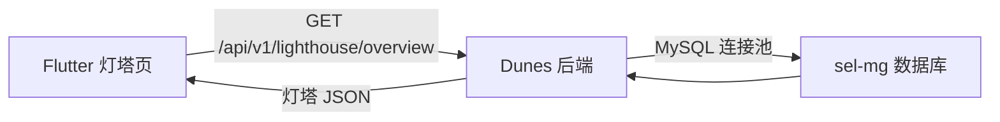

# 灯塔数据接入说明

## 目标

灯塔页面原来使用 `assets/lighthouse/lighthouse_data.json` 静态数据。现在前端已经改成：

1. 只请求后端接口 `/lighthouse/overview`
2. 不再读取本地 mock JSON
3. 页面继续消费同一份 `LighthouseDataBundle` 数据结构

这样后端只要返回约定的数据形状，Flutter 页面不需要重写列表、详情、筛选和指标逻辑。

## 为什么不能 Flutter 直连 MySQL

Flutter Web / App 客户端不能直接保存或使用数据库连接信息：

- 数据库账号密码会进入前端包、浏览器、日志或抓包结果
- 3306 端口不应暴露给客户端网络
- 客户端无法稳定做连接池、权限校验、SQL 口径版本管理

正确做法是：后端连接 MySQL，Flutter 只请求后端 API。



## 前端已完成的接入点

### 1. 统一数据解析

文件：`lib/features/lighthouse/lighthouse_data.dart`

`LighthouseDataBundle.fromJson()` 负责把后端接口返回转成同一套对象：

- `data`
- `product_detail`
- `supply_detail`
- `channel_detail`
- `metrics`

前端已移除本地 mock JSON，不再读取 `assets/lighthouse/lighthouse_data.json`。

### 2. 远程服务

文件：`lib/features/lighthouse/lighthouse_service.dart`

`LighthouseService.fetchOverview()` 请求：

```text
GET http://localhost:6090/api/v1/lighthouse/overview?period=month
Authorization: Bearer <token>
```

支持两种后端返回格式：

```json
{
  "success": true,
  "data": {
    "data": {},
    "product_detail": {},
    "supply_detail": {},
    "channel_detail": {},
    "metrics": {}
  }
}
```

或直接返回：

```json
{
  "data": {},
  "product_detail": {},
  "supply_detail": {},
  "channel_detail": {},
  "metrics": {}
}
```

### 3. 页面加载逻辑

文件：`lib/features/lighthouse/native_lighthouse_page.dart`

当前 `_load()` 逻辑是：

1. 调 `LighthouseService(session: widget.session).fetchOverview(period: _period)`
2. 成功则渲染远程数据
3. 失败则结束 loading 并显示空态
4. 不再读取任何前端 mock JSON

## 后端需要提供的接口

### 接口

```text
GET /api/v1/lighthouse/overview?period=month
```

如果当前 `session.apiBase` 已经包含 `/api/v1`，前端实际请求路径就是：

```text
{session.apiBase}/lighthouse/overview
```

### 鉴权

沿用现有 App 登录态：

```text
Authorization: Bearer <Dunes JWT>
```

建议后端限制只有有权限的角色可以访问灯塔数据。

## 返回数据结构

后端首版建议直接对齐 `assets/lighthouse/lighthouse_data.json`。

顶层字段：

```json
{
  "data": {
    "product": [],
    "supply": [],
    "channel": []
  },
  "product_detail": {},
  "supply_detail": {},
  "channel_detail": {},
  "metrics": {}
}
```

### 一级列表字段

每一行建议包含以下字段，缺失字段前端会按 `0` 处理：

```json
{
  "name": "名称",
  "group": "分类",
  "sales": 0,
  "gmv": 0,
  "gmv2": 0,
  "its": 0,
  "itsAfter": 0,
  "spread": 0,
  "woa": 0,
  "revenue": 0,
  "totalCost": 0,
  "cost": 0,
  "tax": 0,
  "projectCost": 0,
  "saasFee": 0,
  "deferred": 0,
  "discount": 0,
  "profit": 0
}
```

### 详情字典

产品详情：

```json
{
  "product_detail": {
    "产品名称": {
      "name": "产品名称",
      "group": "能源",
      "profit": 0,
      "supply": [],
      "channel": [],
      "project": [],
      "productName": []
    }
  }
}
```

供给方详情：

```json
{
  "supply_detail": {
    "供给方名称": {
      "name": "供给方名称",
      "group": "中石油",
      "profit": 0,
      "product": [],
      "channel": [],
      "project": [],
      "productName": []
    }
  }
}
```

渠道详情的 key 使用 `name::group`：

```json
{
  "channel_detail": {
    "渠道名称::渠道分类": {
      "name": "渠道名称",
      "group": "DICT",
      "profit": 0,
      "product": [],
      "supply": [],
      "project": [],
      "productName": []
    }
  }
}
```

## 后端数据库配置建议

不要把数据库连接信息提交到 Git。建议后端使用环境变量：

```bash
LIGHTHOUSE_DB_URL="jdbc:mysql://<host>:3306/sel-mg?useUnicode=true&characterEncoding=UTF-8&zeroDateTimeBehavior=convertToNull&serverTimezone=Asia/Shanghai&useSSL=false&rewriteBatchedStatements=true"
LIGHTHOUSE_DB_USER="<user>"
LIGHTHOUSE_DB_PASSWORD="<password>"
```

建议同时配置：

- 连接池最大连接数
- SQL 超时时间
- 只读账号
- 后端服务器 IP 白名单
- 慢查询日志

## SQL 聚合口径

后端需要把数据库表聚合成三组一级视图：

- `product`：按产品维度聚合
- `supply`：按供给方/省份/供应侧维度聚合
- `channel`：按渠道维度聚合

再为每个一级项生成详情列表：

- 产品详情下钻：供给、渠道、项目、SKU
- 供给方详情下钻：产品、渠道、项目、SKU
- 渠道详情下钻：产品、供给、项目、SKU

字段口径需要后端和业务确认，尤其是：

- `sales`：销售额
- `gmv` / `gmv2`：引流 GMV / GMV
- `revenue`：收入
- `cost` / `totalCost`：业务成本 / 总成本
- `tax`：税务成本
- `profit`：毛利润
- `spread`：利差
- `discount`：折扣进度

## 验证清单

后端接口打通后，需要验证：

- 灯塔首屏能请求 `/lighthouse/overview`
- 接口失败时能显示空态或错误态
- 产品、供给方、渠道三个一级 tab 都有数据
- 点击一级列表能进入详情页
- 详情页 4 个 sub-tab 都有数据或空态
- 指标 dropdown 可切换显示项
- 分类 dropdown 可筛选 group
- 供给方筛选 `汽油 / 柴油` 能联动 Hero 和合计行
- 排序字段和升降序正常

## 当前仍需要后端完成的部分

当前 Flutter 仓库已经移除 mock 数据并完成后端接口接入点，但没有后端服务代码。后端还需要：

1. 新增 `/api/v1/lighthouse/overview`
2. 使用环境变量连接 MySQL
3. 编写聚合 SQL
4. 返回与后端接口数据 一致的数据结构
5. 接入 JWT 鉴权和角色权限
