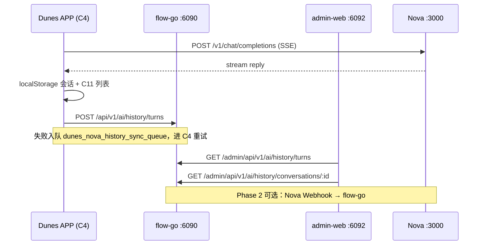

# 云枢对话审计与 Admin 监管集成方案

> **文档用途**：说明 Dunes APP、flow-go 后台、admin-web 工作台、Nova 平台四方如何打通「云枢对话记录」监管链路。  
> **日期**：2026-06-19  
> **状态**：APP + admin-web + **flow-go / admin-go 已实现**；需执行 Flyway V60/V6 迁移后生效；Nova 侧 Phase 2 可选增强。

---

## 1. 背景与问题

| 存储层 | 谁写入 | 谁读取 | 说明 |
|--------|--------|--------|------|
| Nova 平台 | APP → Nova API | Nova 控制台 | 真实 AI 对话，Dunes 不直接读库 |
| flow-go IM | APP（部分 sync） | admin「会话列表」 | 仅 IM 私聊/群聊，**不含云枢** |
| APP localStorage | APP | APP C11 历史页 | 仅本机，Admin 不可见 |
| **flow-go ai_history（新建）** | **APP POST** | **admin「云枢对话记录」** | **本方案目标** |

Admin 工作台「会话列表」与云枢 C4 对话**不是同一数据源**。要在沙丘工作台看到全员云枢记录，需要 APP 每轮对话 upsert 到 flow-go，再由 Admin API 分页查询。

---

## 2. 架构总览



---

## 3. flow-go 已实现接口

实现位置：

| 组件 | 文件 |
|------|------|
| DB 迁移 | `flow-svc/db/migration/V60__ai_history_turn.sql` |
| Store | `flow-go/internal/app/ai_history_store.go` |
| APP + Internal handlers | `flow-go/internal/app/ai_history_handlers.go` |
| Admin 代理 | `admin-go/cmd/admin-svc/main.go` → `routeAIHistory` |
| Admin flow client | `admin-go/internal/flow/client.go` |
| 网关路由 | `scripts/dev-api-gateway.mjs`（`/ai/history/turns` → flow-go） |

### 3.1 数据库表

> 注：生产库为 **PostgreSQL**（Flyway V60），非 MySQL 语法。

```sql
-- 见 flow-svc/db/migration/V60__ai_history_turn.sql
CREATE TABLE ai_history_turn (
  id              BIGSERIAL PRIMARY KEY,
  conversation_id BIGINT NOT NULL,
  message_id      BIGINT NOT NULL DEFAULT 0,
  ...
);
```

<details>
<summary>MySQL 参考 DDL（仅供对照）</summary>

```sql
CREATE TABLE ai_history_turn (
  id              BIGINT PRIMARY KEY AUTO_INCREMENT,
  conversation_id BIGINT NOT NULL,
  message_id      BIGINT DEFAULT 0,
  user_id         BIGINT NOT NULL,
  user_display_name VARCHAR(64),
  biz_user_id     VARCHAR(64),          -- Nova dune_{userId}
  nova_session_id VARCHAR(128),         -- X-Nova-Chat-Session-Id
  title           VARCHAR(64),
  last_message_preview VARCHAR(200),
  user_message    TEXT,
  assistant_message MEDIUMTEXT,
  model           VARCHAR(64),
  source          VARCHAR(16) DEFAULT 'nova',
  last_message_at DATETIME(3) NOT NULL,
  created_at      DATETIME(3) DEFAULT CURRENT_TIMESTAMP(3),
  updated_at      DATETIME(3) DEFAULT CURRENT_TIMESTAMP(3) ON UPDATE CURRENT_TIMESTAMP(3),
  UNIQUE KEY uk_conv_msg (conversation_id, message_id),
  KEY idx_user_time (user_id, last_message_at),
  KEY idx_biz_user (biz_user_id),
  KEY idx_last_at (last_message_at)
);
```

</details>

同一 `conversation_id` + `message_id` 做 upsert（assistant 流式完成后再更新 `assistant_message`）。

### 3.2 APP 写入 — `POST /api/v1/ai/history/turns`

- **鉴权**：Bearer JWT（与普通 APP API 一致）
- **幂等**：`(conversationId, messageId)` 唯一，重复 POST 更新同一条

**请求体：**

```json
{
  "conversationId": 1718800000123,
  "messageId": 1718800000456,
  "title": "帮我写一份周报",
  "lastMessagePreview": "好的，以下是本周工作总结…",
  "lastMessageAt": "2026-06-19T10:30:00.000Z",
  "source": "nova",
  "userId": 2,
  "userDisplayName": "张三",
  "bizUserId": "dune_2",
  "novaSessionId": "sess_abc123",
  "model": "nova_deepseek",
  "userMessage": "帮我写一份周报",
  "assistantMessage": "好的，以下是本周工作总结…"
}
```

**响应：**

```json
{ "success": true, "data": { "id": 1001 } }
```

### 3.3 Admin 列表 — `GET /admin/api/v1/ai/history/turns`

- **鉴权**：Admin JWT + 菜单权限 `/chat/nova-history`
- **Query**：`page`, `size`, `q`（标题/摘要/用户名模糊）, `userId`

**响应：**

```json
{
  "success": true,
  "data": {
    "items": [
      {
        "conversationId": 1718800000123,
        "messageId": 1718800000456,
        "userId": 2,
        "userDisplayName": "张三",
        "bizUserId": "dune_2",
        "title": "帮我写一份周报",
        "lastMessagePreview": "好的，以下是…",
        "model": "nova_deepseek",
        "novaSessionId": "sess_abc123",
        "lastMessageAt": "2026-06-19T10:30:00.000Z"
      }
    ],
    "total": 42,
    "page": 1,
    "size": 20
  }
}
```

### 3.4 Admin 详情 — `GET /admin/api/v1/ai/history/conversations/:conversationId`

按 `conversation_id` 聚合该会话全部 turn，或关联独立 `ai_history_message` 表返回完整消息链。

**响应示例：**

```json
{
  "success": true,
  "data": {
    "conversationId": 1718800000123,
    "userId": 2,
    "userDisplayName": "张三",
    "bizUserId": "dune_2",
    "novaSessionId": "sess_abc123",
    "title": "帮我写一份周报",
    "model": "nova_deepseek",
    "lastMessageAt": "2026-06-19T10:30:00.000Z",
    "messages": [
      { "id": 1, "role": "user", "content": "帮我写一份周报", "createdAt": "2026-06-19T10:29:50.000Z" },
      { "id": 2, "role": "assistant", "content": "好的，以下是…", "createdAt": "2026-06-19T10:30:00.000Z" }
    ]
  }
}
```

### 3.5 APP 读取（已有/沿用）

- `GET /api/v1/ai/history/turns` — C11 历史列表（可与 Admin 共用表，按 `userId` 过滤）

---

## 4. Dunes APP 已实现行为

文件：`flutter/lib/features/im/nova_chat_injection.dart`

| 时机 | 行为 |
|------|------|
| 用户发送消息 | `registerNovaHistoryTurn`（含 userMessage） |
| AI 流式完成 / 停止生成 | `persistNovaAssistantReply` → 含 assistantMessage |
| 会话 flush | `flushNovaConvToLocalHistory` |
| POST 失败 | 写入 `localStorage.dunes_nova_history_sync_queue`，最多 50 条、5 次重试 |
| 进入 C4 | `flushNovaHistorySyncQueue()` 自动重试 |

Payload 字段：`userId`, `userDisplayName`, `bizUserId`, `novaSessionId`, `model`, `userMessage`, `assistantMessage` 等均已带上。

---

## 5. admin-web 已实现

| 路径 | 页面 |
|------|------|
| `/chat/nova-history` | 云枢对话记录列表 |
| `/chat/nova-history/:id` | 对话详情 |

菜单：**聊天监管 → 云枢对话记录**

> 在 flow-go 接口上线前，页面会显示空列表或「暂无数据」提示。

---

## 6. Nova 团队需要做什么（Phase 2 可选）

Phase 1 **不依赖 Nova 改代码**——APP 已在每轮对话后向 flow-go 同步。以下为增强项，可按优先级排期。

### 6.1 【推荐】Assistant 回复中带可下载 HTTPS 链接

生成文件时，请在 Markdown 中使用 **公网 HTTPS** 形式：

```markdown
[report.pdf](https://nova.example.com/files/abc123/report.pdf)
```

Dunes APP 优先渲染此类链接为文件卡片；仅当无 HTTPS 链接时才 fallback 到 `/v1/files/download?path=/opt/data/...`。

### 6.2 【推荐】稳定 Session 标识

APP 请求头已带：

```http
X-Nova-Chat-Session-Id: <uuid>
```

请 Nova 侧：

1. 同一 header 值在多轮对话中保持上下文关联；
2. 在审计/日志中记录该 session id，便于与 Dunes `conversationId` 对账。

### 6.3 【可选】对话完成 Webhook

Nova 在每次 `chat/completions` 流结束后，向 Dunes 配置的 URL POST：

```http
POST https://dunes-api.example.com/api/v1/integrations/nova/chat-completed
Authorization: Bearer <shared-secret>
Content-Type: application/json
```

```json
{
  "event": "chat.completed",
  "bizUserId": "dune_2",
  "novaSessionId": "sess_abc123",
  "model": "nova_deepseek",
  "userMessage": "...",
  "assistantMessage": "...",
  "usage": { "prompt_tokens": 100, "completion_tokens": 200 },
  "finishedAt": "2026-06-19T10:30:00.000Z"
}
```

flow-go 收到后 upsert 同一张 `ai_history_turn` 表，作为 APP 同步的**双写校验**（APP 离线时 Admin 仍可见）。

### 6.4 【可选】Admin 只读审计 API

供 flow-go 定时拉取或按需查询：

```http
GET /v1/admin/audit/sessions?bizUserId=dune_2&from=2026-06-01&to=2026-06-19
Authorization: Bearer <service-key>
```

返回 Nova 侧完整 session 列表与消息摘要，用于与 Dunes DB 对账。

### 6.5 【可选】Usage / 配额事件

若 Nova 有 token 计费，可在 Webhook 或独立事件中带上 `usage`，Dunes 可扩展 Admin 展示「Token 消耗」列。

---

## 7. Nova 团队回复清单

请 Nova 同学确认：

1. **文件下载 URL**：生成文件时能否稳定返回 HTTPS 外链？有效期多久？
2. **Session ID**：`X-Nova-Chat-Session-Id` 是否已在服务端持久化？能否按 session 查询历史？
3. **Webhook**：是否支持对话完成回调？若支持，请提供签名算法与字段文档。
4. **审计 API**：是否已有或计划提供 bizUser 维度的只读查询接口？
5. **时间线**：上述能力预计上线时间？

---

## 8. 联调步骤

1. **执行迁移**：`flow-svc` Flyway V60 + `admin-go` V6（菜单权限）
2. **重启服务**：flow-go、admin-go、dev-api-gateway
3. **APP** 登录后发一条云枢消息，确认 `POST /api/v1/ai/history/turns` 返回 200
4. **admin-web** 打开「云枢对话记录」，能看到该条
5. 断网发消息 → 恢复网络 → 再进 C4，确认队列重试成功
6. （可选）Nova Webhook 双写后，对比 APP 与 Nova 两侧记录一致

---

## 9. 相关文件

| 文件 | 说明 |
|------|------|
| `flutter/lib/features/im/nova_chat_injection.dart` | APP 同步与重试队列 |
| `admin-web/src/pages/NovaHistoryPage.tsx` | Admin 列表页 |
| `admin-web/src/pages/NovaHistoryDetailPage.tsx` | Admin 详情页 |
| `flutter/docs/nova-integration-issues-for-nova-team.md` | Nova 联调总清单 |

---

*文档由 Dunes 开发维护。flow-go 接口落地后请更新本文 §3 的实际路径与示例响应。*
